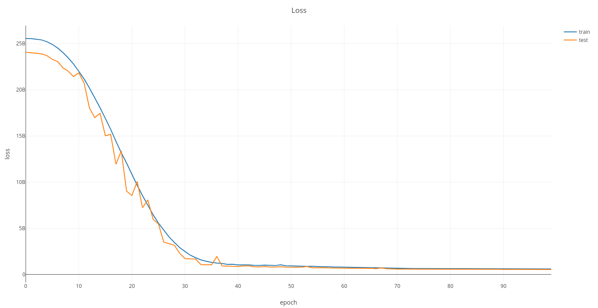
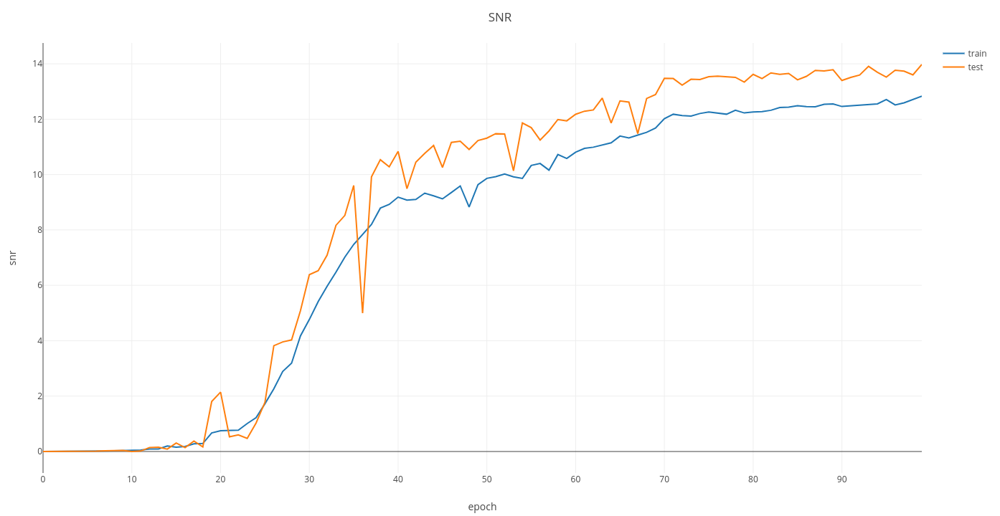

# SpecNet
This is a repository to use hadamard coded data for light intensity estimation

Modifying the settings in args.py and run train and test code:

# Dataset
Download dataset from [Baiduyun](https://pan.baidu.com/s/17KAwNDJ_0oghqkCN5wvjwA) and extract it to data folder

# start
```Bash
sh demo.sh # for training
python main.py main.py --mode test # for testing
```

 

